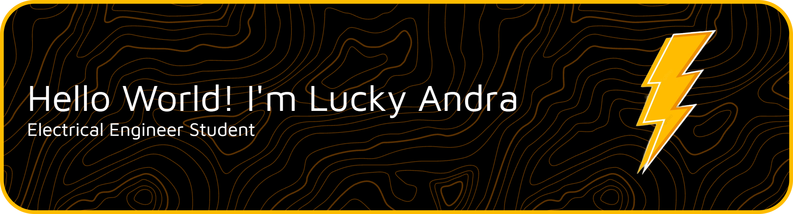

--- 

An **Electrical Engineering** undergraduate who loves combining hardware and software to create meaningful projects.

I enjoy the full journey of product development.

Feel free to explore my repositories and reach out for collaboration!

---

#### Skills

---

<!--
**Luandraa/Luandraa** is a ✨ _special_ ✨ repository because its `README.md` (this file) appears on your GitHub profile.

Here are some ideas to get you started:

- 🔭 I’m currently working on ...
- 🌱 I’m currently learning ...
- 👯 I’m looking to collaborate on ...
- 🤔 I’m looking for help with ...
- 💬 Ask me about ...
- 📫 How to reach me: ...
- 😄 Pronouns: ...
- ⚡ Fun fact: ...
-->

___

#### Lets Connect

---

###

<picture>
  <source media="(prefers-color-scheme: dark)" srcset="https://raw.githubusercontent.com/Luandraa/Luandraa/pacman-output/pacman-contribution-graph-dark.svg">
  <source media="(prefers-color-scheme: light)" srcset="https://raw.githubusercontent.com/Luandraa/Luandraa/pacman-output/pacman-contribution-graph.svg">
  
</picture>

###